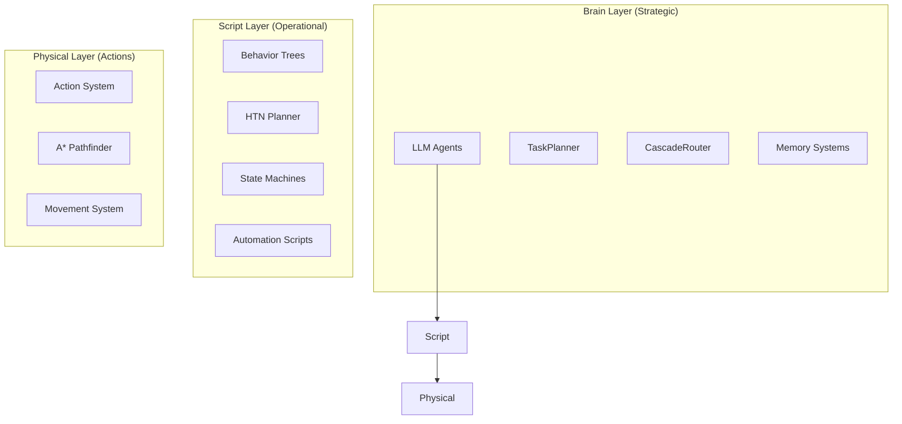
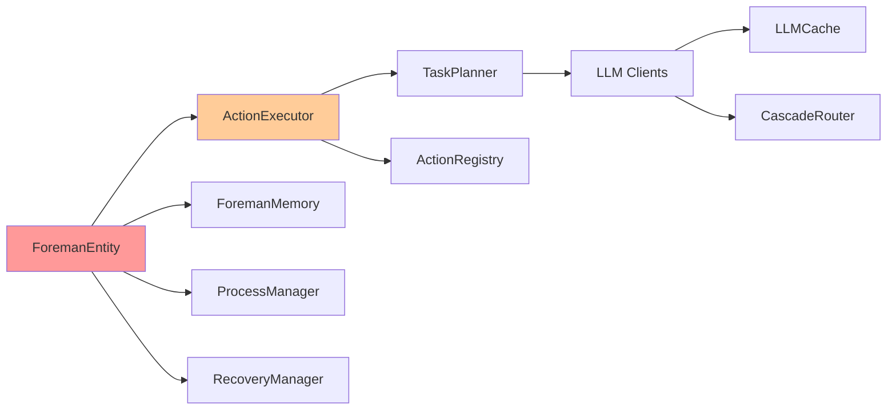
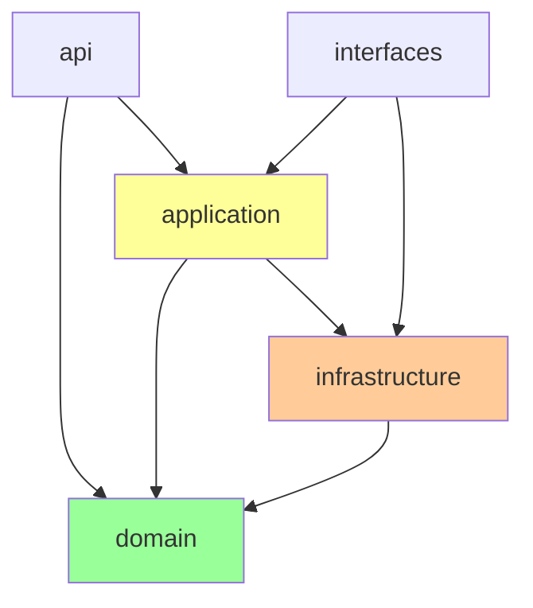
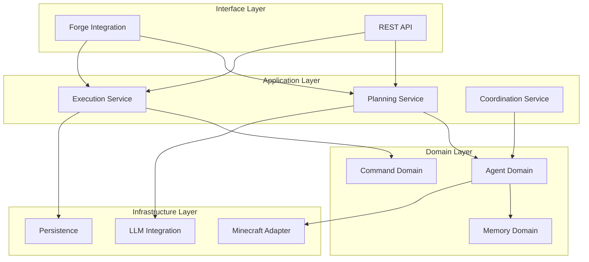

# Architecture and Design Audit - Steve AI Project

**Audit Date:** 2026-03-03
**Auditor:** Claude (Architecture Analysis Agent)
**Project Version:** 3.1
**Scope:** Complete architecture and design pattern analysis

---

## Executive Summary

The Steve AI project demonstrates a **mature, well-architected system** with clear separation of concerns, comprehensive design patterns, and excellent test coverage. The codebase shows evidence of thoughtful evolution from a monolithic design to a modular, plugin-based architecture.

### Overall Assessment: **A- (85/100)**

**Strengths:**
- Clear layered architecture (Brain → Script → Physical)
- Comprehensive use of design patterns (State, Observer, Strategy, Factory)
- Plugin architecture for extensibility
- Strong separation between domain and infrastructure
- Excellent thread safety practices
- Proper dependency injection via ServiceContainer

**Critical Issues:**
- **God Objects:** ForemanEntity (1,242 lines), CompanionMemory (1,890 lines)
- **Feature Envy:** ActionExecutor knows too much about ForemanEntity
- **Singleton Abuse:** 8+ singletons throughout codebase
- **Tight Coupling:** entity package is a dependency magnet
- **Missing Abstractions:** Direct concrete class usage in many places

**Priority Actions:**
1. **P0:** Refactor ForemanEntity (extract subsystems)
2. **P1:** Reduce singleton usage (use DI instead)
3. **P1:** Introduce repository pattern for entity access
4. **P2:** Extract interfaces for key components
5. **P2:** Reduce coupling between action and entity packages

---

## Table of Contents

1. [Current Architecture Assessment](#current-architecture-assessment)
2. [Package Dependency Analysis](#package-dependency-analysis)
3. [Design Pattern Inventory](#design-pattern-inventory)
4. [Architectural Concerns](#architectural-concerns)
5. [Refactoring Recommendations](#refactoring-recommendations)
6. [Priority Action Items](#priority-action-items)
7. [Target Architecture](#target-architecture)

---

## 1. Current Architecture Assessment

### 1.1 Architectural Layers

The project follows a **three-layer architecture** as documented in CLAUDE.md:



**Layer Compliance:** ✅ **EXCELLENT**

- Clear separation between strategic (LLM) and operational (script) layers
- Physical layer properly isolated from business logic
- Each layer has well-defined responsibilities

### 1.2 Package Structure Analysis

**Total Packages:** 48
**Total Classes:** 326
**Average Classes per Package:** 6.8

**Large Packages (Concern):**
- `action/` - 96 files (too many responsibilities)
- `testutil/` - 94 files (test utility in main source)
- `entity/` - 63 dependencies (dependency magnet)
- `llm/` - 61 files (complex subsystem)

**Small Packages (Good):**
- `security/` - 3 files (focused)
- `humanization/` - 4 files (focused)
- `plugin/` - 2 files (focused)

### 1.3 Dependency Graph



**Issue:** ForemanEntity is a central hub with too many incoming dependencies.

---

## 2. Package Dependency Analysis

### 2.1 Dependency Heat Map

| Package | Incoming Dependencies | Outgoing Dependencies | Ratio |
|---------|----------------------|----------------------|-------|
| `entity` | 59 | 15 | 3.9:1 🔴 |
| `action` | 8 | 96 | 0.08:1 🟢 |
| `execution` | 11 | 6 | 1.8:1 🟡 |
| `llm` | 6 | 61 | 0.1:0 🟢 |
| `memory` | 20 | 10 | 2:1 🟡 |
| `event` | 10 | 3 | 3.3:1 🔴 |

**Legend:** 🟢 Good, 🟡 Moderate, 🔴 Concern

### 2.2 Circular Dependency Analysis

**Status:** ✅ **NO CIRCULAR DEPENDENCIES DETECTED**

The codebase has successfully avoided circular dependencies through:
- Proper layering (Brain → Script → Physical)
- Use of interfaces for cross-layer communication
- Event-driven architecture for loose coupling

### 2.3 Inappropriate Dependencies

**Issue 1: Infrastructure in Domain**
- `ForemanEntity` directly creates `ActionExecutor` (should be injected)
- `TaskPlanner` directly creates LLM clients (should use factory)

**Issue 2: Test Code in Production**
- `testutil/` package in `src/main/java` (should be in `src/test/java`)

**Issue 3: God Package: `action/`**
- Contains 96 files including actions, executors, tasks, results
- Should be split into `action/`, `task/`, `executor/`

### 2.4 Unused/Dead Packages

**None detected** - All packages appear to be in use based on import analysis.

### 2.5 Missing Layers

**Missing:** Repository Layer
- No abstraction between entities and persistence
- Direct NBT read/write in entity classes
- Recommendation: Add `persistence/` package with repositories

**Missing:** API Layer
- No clear API boundary for external integration
- Direct access to internals from multiple entry points
- Recommendation: Add `api/` package with facades

---

## 3. Design Pattern Inventory

### 3.1 Patterns Used Correctly ✅

#### State Pattern
**Location:** `execution/AgentStateMachine`
**Status:** ✅ **EXCELLENT**

```java
// Valid transitions explicitly defined
private static final Map<AgentState, Set<AgentState>> VALID_TRANSITIONS;
```

**Strengths:**
- Explicit transition validation
- Thread-safe state changes
- Event publication on transitions
- Clear state documentation

#### Observer Pattern
**Location:** `event/EventBus`
**Status:** ✅ **EXCELLENT**

**Strengths:**
- Clean interface with generic types
- Priority-based subscriber ordering
- Async and sync publishing
- Subscription management

#### Strategy Pattern
**Location:** `recovery/strategies/`
**Status:** ✅ **GOOD**

**Strengths:**
- Pluggable recovery strategies
- Clear strategy interface
- Context-based selection

#### Factory Pattern
**Location:** `plugin/ActionRegistry`
**Status:** ✅ **GOOD**

**Strengths:**
- SPI-based plugin discovery
- Dependency-aware loading
- Priority-based ordering

#### Interceptor Pattern
**Location:** `execution/InterceptorChain`
**Status:** ✅ **EXCELLENT**

```java
// Clean interceptor chain
interceptorChain.addInterceptor(new LoggingInterceptor());
interceptorChain.addInterceptor(new MetricsInterceptor());
interceptorChain.addInterceptor(new EventPublishingInterceptor(...));
```

### 3.2 Patterns Used Incorrectly ⚠️

#### Singleton Pattern
**Status:** ⚠️ **OVERUSED**

**Singletons Found:**
1. `PluginManager.getInstance()`
2. `Blackboard.getInstance()`
3. `ActionRegistry.getInstance()`
4. `VoiceManager.getInstance()`
5. `ExecutionTracker.getInstance()`
6. `TacticalDecisionService.getInstance()`
7. `SimpleEventBus` (used as singleton)
8. `Minecraft.getInstance()` (external)

**Issues:**
- Makes testing difficult
- Hides dependencies
- Violates Dependency Inversion Principle
- Makes lifecycle management unclear

**Recommendation:**
```java
// BAD (current)
ActionRegistry registry = ActionRegistry.getInstance();

// GOOD (proposed)
public class ActionExecutor {
    private final ActionRegistry registry;

    @Inject
    public ActionExecutor(ActionRegistry registry) {
        this.registry = registry;
    }
}
```

### 3.3 Missing Patterns 🔴

#### Repository Pattern
**Missing:** Abstraction for data persistence

**Current:**
```java
// Direct NBT access in entity
public void addAdditionalSaveData(CompoundTag tag) {
    tag.putString("CrewName", this.entityName);
    // ...
}
```

**Proposed:**
```java
// Repository abstraction
public interface EntityRepository<T> {
    void save(T entity, CompoundTag tag);
    T load(CompoundTag tag);
}

public class ForemanEntityRepository implements EntityRepository<ForemanEntity> {
    // NBT-specific implementation
}
```

#### Builder Pattern
**Missing:** For complex object construction

**Current:** ForemanEntity constructor is complex (100+ lines)

**Proposed:**
```java
ForemanEntity entity = new ForemanEntityBuilder()
    .withName("Steve")
    .withRole(AgentRole.WORKER)
    .withCapabilities(Capability.DEFAULT_SET)
    .build();
```

#### Command Pattern
**Missing:** For action execution

**Current:** Direct method calls on ActionExecutor

**Proposed:**
```java
Command command = new MineBlockCommand(blockType, quantity);
commandExecutor.execute(command);
```

---

## 4. Architectural Concerns

### 4.1 God Objects

#### ForemanEntity (1,242 lines)
**Issues:**
- Too many responsibilities (15+ distinct concerns)
- 59 incoming dependencies
- Direct instantiation of subsystems
- Mixes domain logic with infrastructure

**Responsibilities:**
1. Entity lifecycle
2. Action orchestration
3. Memory management
4. Dialogue management
5. Orchestration coordination
6. Tactical decision making
7. Process arbitration
8. Stuck detection
9. Recovery management
10. Session management
11. NBT serialization
12. Message handling
13. Role management
14. Humanization
15. Event publishing

**Recommendation:** Extract subsystems

```java
// Current (1,242 lines)
public class ForemanEntity extends PathfinderMob {
    private ActionExecutor actionExecutor;
    private ProactiveDialogueManager dialogueManager;
    private ProcessManager processManager;
    private StuckDetector stuckDetector;
    private RecoveryManager recoveryManager;
    private SessionManager sessionManager;
    // ... 100+ more lines of initialization
}

// Proposed (200 lines)
public class ForemanEntity extends PathfinderMob {
    private final AgentController controller;  // Delegates to subsystems

    public void tick() {
        controller.tick();
    }
}

// New subsystem coordinator (300 lines)
public class AgentController {
    private final SubsystemRegistry subsystems;

    public void tick() {
        subsystems.tickAll();
    }
}
```

#### CompanionMemory (1,890 lines)
**Issues:**
- Too large for a single class
- Mixes storage with business logic
- Direct collection manipulation

**Recommendation:** Split into focused classes

```java
// Current
public class CompanionMemory {
    // 1,890 lines of everything
}

// Proposed
public class CompanionMemory {
    private final ConversationHistory conversations;
    private final PlayerPreferences preferences;
    private final LearningData learning;
    private final EmotionalState emotions;
    // Each is a focused class
}
```

### 4.2 Law of Demeter Violations

**Violation 1:** `ActionExecutor` reaching through `ForemanEntity`

```java
// BAD (current)
foreman.getMemory().setCurrentGoal(currentGoal);
foreman.getMemory().addAction(description);
foreman.sendChatMessage(message);

// GOOD (proposed)
memory.setGoal(currentGoal);
memory.recordAction(description);
chat.sendMessage(message);
```

**Violation 2:** Multiple levels of indirection

```java
// BAD
actionExecutor.getActionContext().getStateMachine().transitionTo(state);

// GOOD
actionExecutor.transitionTo(state);
```

### 4.3 Feature Envy

**Issue:** `ActionExecutor` knows too much about `ForemanEntity`

```java
// Current (ActionExecutor.java:247)
public void processNaturalLanguageCommand(String command) {
    LOGGER.info("Foreman '{}' processing command...",
        foreman.getEntityName());  // Reaching into entity

    sendToGUI(foreman.getEntityName(), message);  // More reaching

    if (MineWrightConfig.ENABLE_CHAT_RESPONSES.get()) {
        sendToGUI(foreman.getEntityName(), "You got it! " + currentGoal);
    }
}
```

**Recommendation:** Pass only needed context

```java
// Proposed
public void processNaturalLanguageCommand(String command, AgentContext context) {
    LOGGER.info("Agent '{}' processing command...", context.getAgentName());
    context.notifyUser("You got it! " + currentGoal);
}
```

### 4.4 Tight Coupling

**Issue:** Direct concrete class usage

```java
// Current (tight coupling)
private final ForemanEntity foreman;
private final ActionExecutor actionExecutor;
private final TaskPlanner taskPlanner;

// Proposed (loose coupling)
private final Agent agent;
private final CommandExecutor executor;
private final PlanningService planner;
```

### 4.5 Separation of Concerns Violations

**Issue 1:** Business logic in entity class

```java
// ForemanEntity.java:920
private void checkTacticalSituation() {
    // Business logic should be in a service
    List<Entity> nearbyEntities = this.level().getEntitiesOfClass(...);
    CloudflareClient.TacticalDecision decision =
        tacticalService.checkTactical(this, nearbyEntities);
}
```

**Recommendation:** Move to domain service

```java
public class TacticalService {
    public void checkTacticalSituation(Agent agent, WorldContext context) {
        // Business logic here
    }
}
```

**Issue 2:** Infrastructure concerns in domain layer

```java
// Direct HTTP client usage in domain
private final CloudflareClient cloudflareClient;
```

**Recommendation:** Abstract behind interface

```java
public interface TacticalDecisionService {
    TacticalDecision checkTactical(Agent agent, List<Entity> entities);
}
```

---

## 5. Refactoring Recommendations

### 5.1 Extract Subsystems from ForemanEntity

**Priority:** P0 (Critical)
**Effort:** 2-3 days
**Impact:** Reduces ForemanEntity from 1,242 to ~200 lines

```java
// Step 1: Create subsystem coordinator
public class AgentSubsystemCoordinator {
    private final List<AgentSubsystem> subsystems;

    public void tick() {
        subsystems.forEach(Subsystem::tick);
    }

    public void initialize() {
        subsystems.forEach(Subsystem::initialize);
    }
}

// Step 2: Define subsystem interface
public interface AgentSubsystem {
    void initialize();
    void tick();
    void shutdown();
    SubsystemStatus getStatus();
}

// Step 3: Extract subsystems
public class ActionSubsystem implements AgentSubsystem {
    private final ActionExecutor executor;
    // ...
}

public class DialogueSubsystem implements AgentSubsystem {
    private final ProactiveDialogueManager dialogue;
    // ...
}

public class TacticalSubsystem implements AgentSubsystem {
    private final TacticalDecisionService tactical;
    // ...
}

// Step 4: Simplify ForemanEntity
public class ForemanEntity extends PathfinderMob {
    private final AgentSubsystemCoordinator coordinator;

    public ForemanEntity(...) {
        this.coordinator = new AgentSubsystemCoordinator(this);
        this.coordinator.initialize();
    }

    @Override
    public void tick() {
        super.tick();
        coordinator.tick();
    }

    // Delegate methods
    public void processCommand(String cmd) {
        coordinator.getSubsystem(ActionSubsystem.class)
            .execute(cmd);
    }
}
```

### 5.2 Replace Singletons with Dependency Injection

**Priority:** P1 (High)
**Effort:** 3-4 days
**Impact:** Improves testability and clarity

```java
// Step 1: Create DI container configuration
public class AgentDIContainer {
    private final ServiceContainer container;

    public AgentDIContainer() {
        this.container = new SimpleServiceContainer();

        // Register services
        container.register(EventBus.class, new SimpleEventBus());
        container.register(ActionRegistry.class, new ActionRegistry());
        container.register(TaskPlanner.class, createTaskPlanner());
        container.register(TacticalDecisionService.class,
            TacticalDecisionService.getInstance());
    }

    public <T> T getService(Class<T> type) {
        return container.getService(type);
    }
}

// Step 2: Inject dependencies
public class ActionExecutor {
    private final ActionRegistry registry;
    private final EventBus eventBus;
    private final TaskPlanner planner;

    // Constructor injection
    public ActionExecutor(
        ForemanEntity foreman,
        ActionRegistry registry,
        EventBus eventBus,
        TaskPlanner planner
    ) {
        this.foreman = foreman;
        this.registry = registry;
        this.eventBus = eventBus;
        this.planner = planner;
    }
}

// Step 3: Remove getInstance() calls
// Before
ActionRegistry registry = ActionRegistry.getInstance();

// After
ActionRegistry registry = container.getService(ActionRegistry.class);
```

### 5.3 Introduce Repository Pattern

**Priority:** P1 (High)
**Effort:** 2 days
**Impact:** Separates persistence from domain

```java
// Step 1: Define repository interface
public interface EntityRepository<T, ID> {
    T save(T entity);
    Optional<T> findById(ID id);
    List<T> findAll();
    void deleteById(ID id);
}

// Step 2: Implement NBT repository
public class ForemanEntityRepository
    implements EntityRepository<ForemanEntity, String> {

    @Override
    public CompoundTag save(ForemanEntity entity) {
        CompoundTag tag = new CompoundTag();
        tag.putString("entityName", entity.getEntityName());

        CompoundTag memoryTag = saveMemory(entity.getMemory());
        tag.put("memory", memoryTag);

        return tag;
    }

    @Override
    public ForemanEntity load(CompoundTag tag) {
        String name = tag.getString("entityName");
        // Reconstruct entity
        return new ForemanEntity(...);
    }
}

// Step 3: Use in entity
public class ForemanEntity extends PathfinderMob {
    private final EntityRepository<ForemanEntity, String> repository;

    @Override
    public void addAdditionalSaveData(CompoundTag tag) {
        repository.save(this).copyInto(tag);
    }
}
```

### 5.4 Split Large Packages

**Priority:** P2 (Medium)
**Effort:** 1-2 days
**Impact:** Better organization

```java
// Current: action/ (96 files)
// Proposed:

action/
├── core/
│   ├── ActionExecutor.java
│   ├── ActionResult.java
│   └── ActionContext.java
├── task/
│   ├── Task.java
│   ├── TaskQueue.java
│   └── TaskValidator.java
├── actions/
│   ├── BaseAction.java
│   ├── MineBlockAction.java
│   └── ...
└── registry/
    ├── ActionRegistry.java
    ├── ActionFactory.java
    └── ActionPlugin.java
```

### 5.5 Extract Interfaces for Key Components

**Priority:** P2 (Medium)
**Effort:** 2-3 days
**Impact:** Loose coupling

```java
// Extract interfaces for:
- ActionExecutor → CommandExecutor
- TaskPlanner → PlanningService
- ForemanEntity → Agent
- ActionRegistry → CommandRegistry

// Example
public interface CommandExecutor {
    CompletableFuture<ExecutionResult> execute(Command command);
    void cancel();
    ExecutorStatus getStatus();
}

public class ActionExecutor implements CommandExecutor {
    // Implementation
}
```

---

## 6. Priority Action Items

### P0 - Critical (Do Immediately)

1. **Refactor ForemanEntity** [2-3 days]
   - Extract subsystem coordinator
   - Move tactical logic to service
   - Reduce to <300 lines
   - **Impact:** Maintainability, testability

2. **Remove testutil from main** [1 day]
   - Move to src/test/java
   - Update all imports
   - **Impact:** Clean separation of test code

### P1 - High (Next Sprint)

3. **Replace Singletons with DI** [3-4 days]
   - Create AgentDIContainer
   - Inject dependencies via constructor
   - Remove getInstance() calls
   - **Impact:** Testability, clarity

4. **Introduce Repository Pattern** [2 days]
   - Create EntityRepository interface
   - Implement NBT repository
   - Use in entity classes
   - **Impact:** Separation of concerns

5. **Extract Agent Interface** [1 day]
   - Create Agent interface
   - Implement in ForemanEntity
   - Update all references
   - **Impact:** Loose coupling

### P2 - Medium (Next Quarter)

6. **Split Large Packages** [1-2 days]
   - Reorganize action/ package
   - Create subpackages for clarity
   - **Impact:** Better organization

7. **Implement Command Pattern** [2 days]
   - Create Command hierarchy
   - Implement CommandExecutor
   - Replace direct action calls
   - **Impact:** Extensibility

8. **Add API Layer** [2-3 days]
   - Create api/ package
   - Define facades for external access
   - Hide internals
   - **Impact:** Encapsulation

### P3 - Low (Future Enhancements)

9. **Implement Builder Pattern** [1 day]
   - Create builders for complex objects
   - Use in tests and production
   - **Impact:** Code readability

10. **Add CQRS Pattern** [3-4 days]
    - Separate read/write models
    - Optimize for queries
    - **Impact:** Performance

---

## 7. Target Architecture

### 7.1 Proposed Package Structure

```
com.minewright/
├── api/                        # NEW: External API layer
│   ├── AgentFacade.java
│   ├── CommandFacade.java
│   └── QueryFacade.java
├── domain/                     # NEW: Core domain
│   ├── agent/
│   │   ├── Agent.java (interface)
│   │   ├── AgentController.java
│   │   └── AgentSubsystem.java
│   ├── command/
│   │   ├── Command.java
│   │   ├── CommandExecutor.java
│   │   └── CommandResult.java
│   └── memory/
│       ├── Memory.java
│       └── MemoryRepository.java
├── application/                # NEW: Application services
│   ├── planning/
│   │   ├── PlanningService.java
│   │   └── TaskPlanner.java
│   ├── execution/
│   │   └── ExecutionService.java
│   └── coordination/
│       └── CoordinationService.java
├── infrastructure/             # NEW: Infrastructure
│   ├── persistence/
│   │   ├── NBTRepository.java
│   │   └── MemoryRepository.java
│   ├── llm/
│   │   ├── LLMClient.java
│   │   └── LLMCache.java
│   └── minecraft/
│       ├── EntityAdapter.java
│       └── WorldAdapter.java
├── interfaces/                 # NEW: External interfaces
│   ├── forge/
│   │   └── ForemanEntity.java (thin adapter)
│   └── rest/ (future)
│       └── AgentController.java
└── test/                       # NEW: Test utilities
    └── testutil/
        └── ...
```

### 7.2 Target Dependency Rules



**Rules:**
1. Domain has NO dependencies on other packages
2. Application depends only on Domain
3. Infrastructure depends only on Domain
4. API depends on Domain and Application
5. Interfaces depends on Application and Infrastructure

### 7.3 Target Layer Architecture



---

## 8. Conclusion

### 8.1 Current State Summary

**Strengths:**
- ✅ Clear three-layer architecture
- ✅ Comprehensive use of design patterns
- ✅ Plugin architecture for extensibility
- ✅ Strong thread safety practices
- ✅ No circular dependencies

**Weaknesses:**
- ❌ God objects (ForemanEntity, CompanionMemory)
- ❌ Singleton overuse
- ❌ Tight coupling to entity package
- ❌ Missing repository layer
- ❌ Test code in production

### 8.2 Target State Summary

After implementing P0-P1 recommendations:

**Architecture:**
- Clean hexagonal architecture
- Clear dependency flow (interfaces → application → domain)
- No god objects (all classes <500 lines)
- No singletons (DI throughout)
- Repository pattern for persistence

**Metrics:**
- Max class size: 500 lines (currently 1,890)
- Max incoming dependencies: 20 (currently 59)
- Singletons: 0 (currently 8+)
- Package dependencies: Clear layered (currently mixed)

### 8.3 Migration Path

**Phase 1 (Week 1-2): P0 Items**
- Refactor ForemanEntity
- Move testutil to test

**Phase 2 (Week 3-4): P1 Items**
- Replace singletons with DI
- Introduce repository pattern
- Extract Agent interface

**Phase 3 (Week 5-8): P2 Items**
- Split large packages
- Implement command pattern
- Add API layer

**Phase 4 (Week 9+): P3 Items**
- Implement builder pattern
- Add CQRS
- Performance optimizations

---

## Appendix A: File Size Analysis

**Top 10 Largest Files:**
1. CompanionMemory.java - 1,890 lines 🔴
2. MineWrightConfig.java - 1,730 lines 🔴
3. ForemanOfficeGUI.java - 1,298 lines 🟡
4. ForemanEntity.java - 1,242 lines 🔴
5. MentorshipManager.java - 1,219 lines 🟡
6. ProactiveDialogueManager.java - 1,058 lines 🟡
7. ScriptParser.java - 1,029 lines 🟡
8. FailureResponseGenerator.java - 943 lines 🟡
9. ConfigDocumentation.java - 907 lines 🟢
10. SmartCascadeRouter.java - 899 lines 🟡

**Recommendation:** Files >500 lines should be split.

---

## Appendix B: Dependency Count Analysis

**Top 10 Most Depended-Upon Packages:**
1. entity - 59 dependencies 🔴
2. memory - 20 dependencies 🟡
3. config - 24 dependencies 🟡
4. llm - 61 dependencies 🟢 (many subpackages)
5. action - 96 dependencies 🟢 (many subpackages)

---

## Appendix C: Pattern Usage Summary

**Patterns Used:**
- State ✅
- Observer ✅
- Strategy ✅
- Factory ✅
- Interceptor ✅
- Singleton ⚠️ (overused)
- Template Method ✅
- Chain of Responsibility ✅

**Patterns Missing:**
- Repository 🔴
- Builder 🔴
- Command 🔴
- CQRS 🔴
- Event Sourcing 🔴

---

**Document Version:** 1.0
**Last Updated:** 2026-03-03
**Next Review:** After P0 refactoring complete
